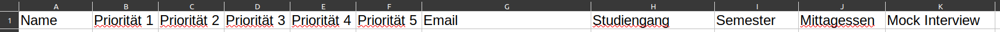
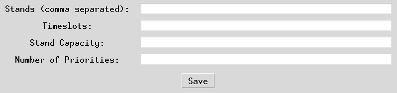
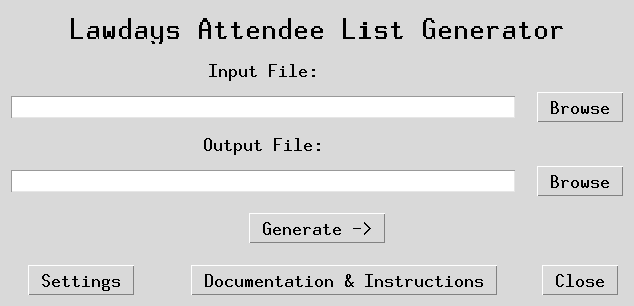
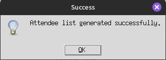

# Lawdays
Python GUI for creating an attendee List

# Schritt für Schritt Anleitung

### 1. CSV-Datei vorbereiten

Da die Software keine Excel-Dataeien (xslx) lesen kann, muss die aus dem MS-Forms extrahierte Excel-Tabelle in eine CSV-Datei umgewandelt werden.

Bevor das gemacht wird sollten allerdings die Spaltennamen bereinigt werden. Das Programm erwartet, dass die Spaltennamen immer gleich sind, weswegen diese eventuell angepasst werden sollten.
Es spielt keine Rolle, in welcher Reihenfolge die Spalten aufgeführt sind, es ist nur wichtig, dass sie vorhanden sind. Die Spalten heissen wie folgt: (TN = Teilnehmer/in)

|Spaltenname|Erwartete Werte|
|---|---|
|Name|Vor- und Nachname TN|
|Studiengang|Studiengang Teilnehemer (optional)|
|Semester|Aktuelles Semester TN (optional)|
|Email|E-Mail Addresse TN (optional)|
|Mittagessen|Ja/Nein (optional)|
|Mock Interview|Ja/Nein (optional)|
|Priorität 1|Der Name der Agentur, welche vom TN als erste Priorität angegeben wurde.|
|Priorität [n]|Pro Priorität muss eine Spalte in mit diesem Format vorhanden sein. Keine Zahl darf mehrmals vorkommen|

Die mit "optional" ergänzten Spalten müssen vorhanden sein, können aber leer sein. Sie werden bloss in die resultierende Datei kopiert.

Die erste Zeile der Excel-Tabelle sollte danach ungefähr so aussehen; die Reihenfolge und weitere im Excel vorhandene Spalten spielen keine Rolle.

### 2. Einstellungen setzen

 
Damit das Programm die Verteilung optimal kalkulieren kann, muss es einige Dinge wissen. Um diese Einzustellen im Hauptfenster auf "Settings" klicken.

Dort angekommen benötigt es vier Dinge:

|Einstellung|Erwarteter Wert|
|---|---|
|Stands|Eine mit einem Komma (,) separierte Liste mit den Namen aller Aussteller|
|Timeslots|Anzahl Runden in der Rotation Fair|
|Stand Capacity|Anzahl TN, die gleichzeitig an einem Tisch sitzen können|
|Number of Priorities|Anzahl Prioritäten, die die TN bei der Anmeldung angeben konnten. Auch die Anzahl Spalten, welche in der Excel / CSV Datei als Prioritäten angegeben sind|

Um die Liste der Aussteller zu kreieren, empfehle ich, die Liste zuerst in Word oder Notepad zu erstellen und kontrollieren. Wenn alle Namen richtig (heisst gleich wie im Anmeldungsformular) geschrieben sind, kann die liste in das Feld kopiert werden.
**ACHTUNG:** keine Zeilenumschläge, diese werden sonst als Aussteller interpretiert!

Die Einstellungen werden nur temporär gespeichert. Dies hat zur Konsequenz, dass jedes Mal wenn das Programm neu geöffnet wird, alle Einstellungen neu gesetzt werden müssen.

Wenn alle Einstellungen getätigt wurden, auf "Save" klicken

### 3. Dateien auswählen

Zurück auf dem Hauptfenster gibt man den Dateipfad zur im Schritt 1 erstellten CSV-Datei bei "Input File" ein. Alternativ kann man sie mit dem "Browse"-Knopf selbst suchen.

Dasselbe gilt beim "Output File", an diesem Ort wird die neue Tabelle mit der Teilnehmereinteilung abgelegt. **Falls bereits eine Datei mit demselben Namen existiert wird diese ÜBERSCHRIEBEN**.

### 4. Liste generieren

Jetzt muss nur noch der "Generate"-Knopf betätigt werden. Wenn alles richtig gemacht wurde, poppt eine Bestätigung auf.

  

# Vorgehen bei Problemen

Ich habe dieses Projekt innerhalb von wenigen Tagen zusammengewürfelt, es kann also gut sein, dass sich Bugs oder unvorhergesehene Verhaltungsweisen eingeschlichen haben.

### 1. Schritte genau lesen und erneut versuchen
Die meisten Probleme sind Resultate von Nutzerfehlern😶‍🌫️

### 2. Falls die Dokumentation nicht weiter hilft
Ich bin per E-Mail erreichbar: demianflury@proton.me